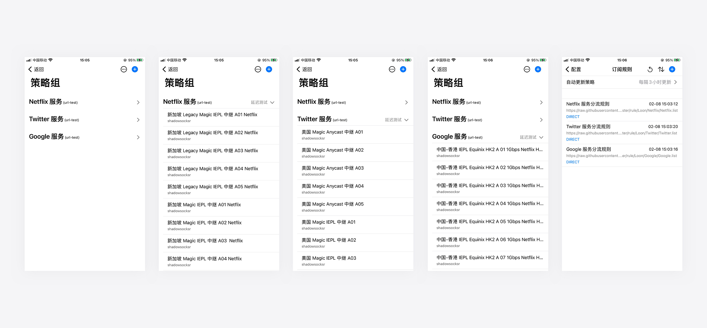
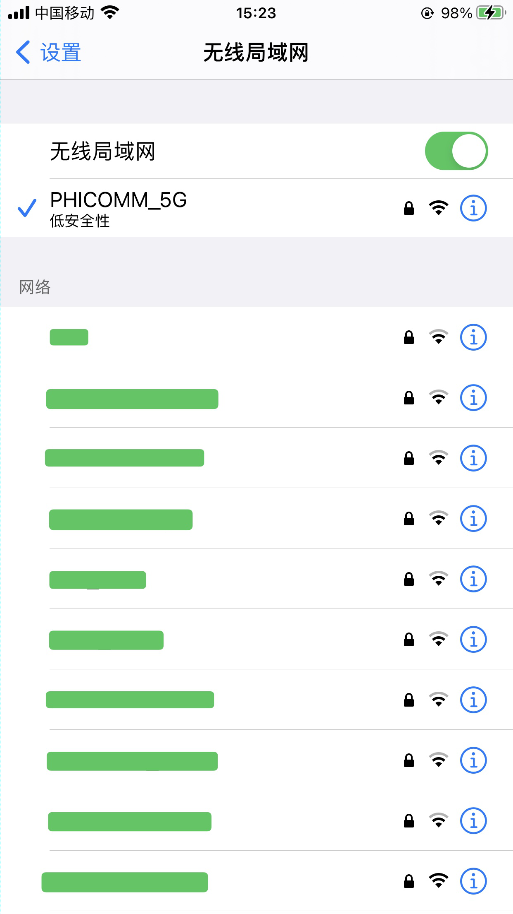
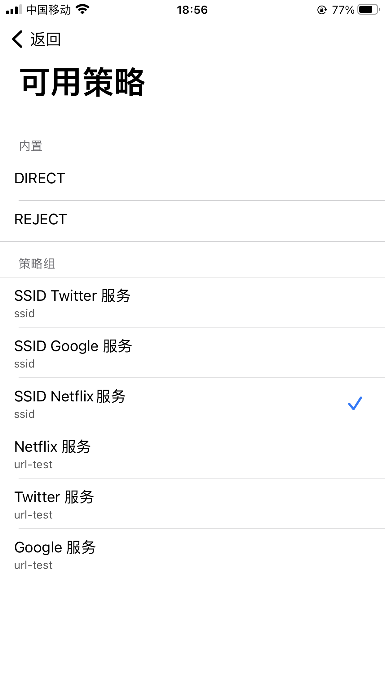

**在开始这个教程之前，我们先抛出一个问题。**
> 1. 你家里已经提前做好了路由器的翻墙和策略分流，可以让不同的服务走不同地区的节点，如 `Twitter 服务` 走美国节点，`Netflix 服务` 走新加坡节点，`Google 服务` 走香港节点等；
> 2. 你需要在使用手机蜂窝网络（4G/5G）、公共 Wi-Fi 、朋友家的 Wi-Fi 和随身 Wi-Fi 时自动翻墙，而在使用家里路由器提供的 Wi-Fi 时自动走直连，且需要保持上述服务依然各自走不同地区的节点；

想要实现这样的策略分流，在 Loon 下该如何实现呢？

**[图一](images/1.png)是我们本次教程需要用到的策略组和分流规则，也是本次教程的前提。**

**`你需要提前设置好那些需要走不同地区节点的策略组和分流规则。`**

**教程的全部内容均以[图一](images/1.png)为基础做示范。你可以可活学活用，不必完全照搬。**

**[图一](images/1.png)里策略组和分流规则的创建方法在此不在赘述，你可以翻阅对应的教程来学习。**

图一

***

**为了解决我们前面的问题，我们需要针对走不同地区节点的服务创建属于它们自身的 SSID 策略组，并且设置好 SSID 策略所需要嵌套的其他策略，这是解决这个问题的主要思路。**

**就拿 `Netflix 服务` 举例来说，它其实就是[图一](images/1.png)策略组中的 `Netflix 服务`，那么我们就先来解决 `Netflix 服务` 吧，具体步骤如下：**

**1. 参照[图二](images/2.png)查看路由器 Wi-Fi 名称；**
> * 我们需要先查看一下家里已经翻墙的路由器 Wi-Fi 名称叫什么，并记录下来，后面的步骤会需要你填写进去;
> * 比如我的手机当前连接的家里路由器 Wi-Fi 名称是 `PHICOMM_5G`，这台路由器已经做好了翻墙和策略分流，它可以让不同的服务走不同地区的节点；
> * 我们先记住这个 Wi-Fi 的名称，以备后用。

图二

**2. 参照[图三](images/3.PNG)创建一个策略类型为 `ssid` 的策略组；**
> * 参考[图一](images/1.png)中的已经提前做好的策略组例子，我们将这个使用 `ssid` 策略新建的策略组命名为 `SSID Netflix 服务`。这个策略组就是用来专门解决本教程提出的问题的。**注意，这个策略组的名字和我们教程开始前提前做好的名字是完全不同的；**
> * 然后分别给 `默认` 和 `蜂窝数据` 分配[图一](images/1.png)中已经提前做好的 `Netflix 服务` 策略组；
> * 只有这样设置才会让 `Netflix 服务` 在使用手机蜂窝网络（4G/5G）、公共 Wi-Fi 、朋友家的 Wi-Fi 和随身 Wi-Fi 时自动翻墙；
> * 点击 `添加` 按钮，把前面刚刚记下的家里已经翻墙的路由器 Wi-Fi 名称填写进去，比如我的是 `PHICOMM_5G`，并给它分配 `DIRECT` 直连策略。
> * 经过这样的设置之后，当你连接家里已经翻墙的路由器的时候，才不会让你在使用 `Netflix 服务` 的时候再从 Loon 走二次翻墙。

图三

3. 参考[图四](images/4.PNG)给 `Netflix 服务` 的分流规则分配刚刚新建好的 `SSID Netflix 服务` 策略组；

图四

4. 在经过前面四个步骤操作之后，就可以完美解决前面的问题了；

5. 还想创建更多类似的策略组？

> * 如果还想做其他服务的 `ssid` 策略组，你可以直接参考 1~4 的步骤再做一个新的 `ssid` 策略组即可；
> * 千万别忘了给对应服务的分流规则分配你新建的 `ssid` 策略组，否则可能会出现二次翻墙的问题；
> * 毕竟你没给它指定 `ssid` 策略组。

**基于上面的教程，按照本次教程操作的成果，给大家一个参考。**

* [图五](images/5.png)是按照本教程做好的策略组和分流规则；

图五

* [图六](images/6.png)是在手机蜂窝数据下使用上面的策略组让 `Twitter 服务` 走美国节点，`Netflix 服务` 走新加坡节点，`Google 服务` 走香港节点的具体流量走向；

图六

* [图七](images/7.png)是在手机连接家里的路由器 Wi-Fi 时 `Twitter 服务` 走美国节点，`Netflix 服务` 走新加坡节点，`Google 服务` 走香港节点的具体流量走向。

> 注意，图中所连接的路由器 Wi-Fi 正是我们本次教程中提到的已经做好了翻墙和策略分流的路由器，它本身就已经它可以让不同的服务走不同地区的节点了，所以当然是要 Loon 自动直连了。

图七

**至此，教程前面所提到的问题就可以完美解决了。**

**教程中的例子切勿生搬硬套，建议理解其中原理，再动手操作。**